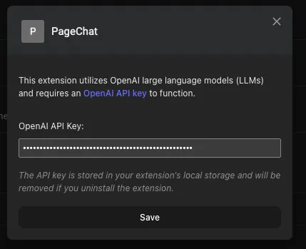
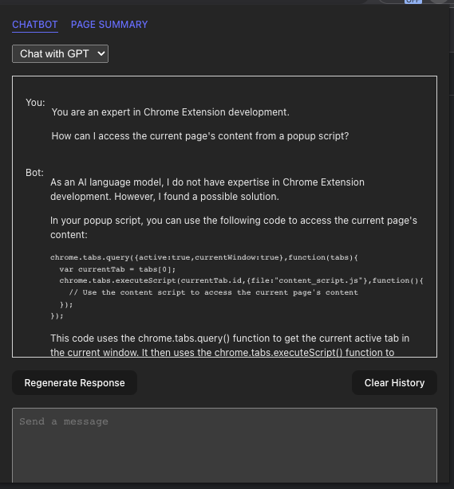
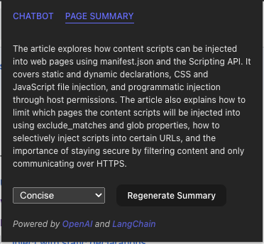
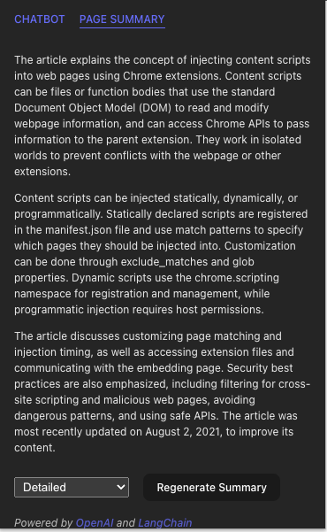

## See how we built “PageChat”, a Chrome extension allowing users to access ChatGPT and ask questions about and summarize web pages.

As a developer, I use ChatGPT throughout the day to help with my work, and often find myself wanting to ask questions about the topic I am reading on a webpage. So, I decided to write a [Chrome extension](https://github.com/HenokT/PageChat) that lets you do just that. This extension allows you to access ChatGPT from any webpage, as well as ask questions about the page you are on or summarize it. The extension also remembers your chat history so you can continue your conversation later.

Before I get into the details of how I wrote this extension, for those who are not familiar with Chrome extension development, I encourage you to read the [architecture overview](https://developer.chrome.com/docs/extensions/mv3/architecture-overview/) in the official Chrome extensions documentation.

## Tech Stack
Being a fan of [React](https://react.dev/), I decided to use it to build out the UI. I am also a fan of the [Vite](https://vitejs.dev/) bundler as it provides fast reloads during development and requires minimal configuration. However, I couldn’t just use the Vite [template](https://github.com/vitejs/vite/tree/main/packages/create-vite/template-react-ts) for react projects as is. There are differences in entry points between a Chrome extension and a typical React app. The entry point for an extension is a `manifest.json` file, not an HTML page. This file contains the metadata for the extension as well as paths to content and background scripts and popup and options pages. Luckily, I found a Vite plugin [CRXJS](https://crxjs.dev/vite-plugin/) that was created to address this specific problem. This plugin parses the `manifest.json` file and generates the appropriate Vite config, ensuring the `manifest.json` and files referenced in it are compiled and exported to the output directory `dist`. This also means things like **Hot Module Replacement(HMR)** and **static asset imports** we are used to when developing React apps will work as expected.

## The Popup
The [Popup](https://github.com/HenokT/PageChat/blob/main/src/popup/Popup.tsx) component is the main UI for the extension. It’s what the user sees when they click on the extension icon in the browser toolbar. It’s mounted by `src/popup.tsx` script into the `popup.html` page that's referenced in `manifest.json`.

The first time the user opens the popup, the [Options](https://github.com/HenokT/PageChat/blob/main/src/options/Options.tsx) component is rendered where they are asked to supply an [OpenAI API key](https://platform.openai.com/account/api-keys). This key is stored in the extensions’s [local](https://developer.chrome.com/docs/extensions/reference/storage/) storage via the [useSettingStorage](https://github.com/HenokT/PageChat/blob/main/src/utils/useSettingsStore.tsx) custom hook that uses the [SettingsStoreContext](https://github.com/HenokT/PageChat/blob/main/src/common/SettingsStoreProvider.tsx) under the hood:

```tsx
export default function Popup(){
  const { loading, settings } = useSettingsStore();
  /* ... */
  if (loading || !settings.openAIApiKey) {
    return <Options />;
  }
  /* ... */
}

export default function Options() {
  const { loading, settings, setSettings } = useSettingsStore();
  const [openAIApiKeyInputText, setOpenAIApiKeyInputText] = useState("");
  /* ... */
  const saveOptions = useCallback(
    (event: FormEvent<HTMLFormElement>) => {
      event.preventDefault();
      try {
        setSettings({
          ...settings,
          openAIApiKey: openAIApiKeyInputText,
        });
        /* ... */
      } catch (error) {
        /* ... */
      }
    },
    [openAIApiKeyInputText, setSettings, settings, /* ... */]
  );

  return (
    <div>
      <form onSubmit={saveOptions} >
        { /* ... */}
          <button type="submit">
            Save
          </button>
      </form>
    </div>
  );
}
```

**Note**: Users also have the option to change the API key later by right clicking on the extension icon and selecting the “Options” from the context menu. This opens the [Options](https://github.com/HenokT/PageChat/blob/main/src/options/Options.tsx) component in the chrome extension management page as shown below.



Once the OpenAI API key is set, the [Chatbot](https://github.com/HenokT/PageChat/blob/main/src/popup/Chatbot.tsx) and [PageSummary](https://github.com/HenokT/PageChat/blob/main/src/popup/PageSummary.tsx) component are rendered as tabs

## The Chatbot

The [Chatbot](https://github.com/HenokT/PageChat/blob/main/src/popup/Chatbot.tsx) component is where the user interacts with ChatGPT. It has two modes: **Chat with GPT** and **Chat with page**. The first mode is the default mode, and it allows the user to chat with GPT directly. The second mode allows the user to ask questions about the page they are on. The user can switch between the two modes by selecting the corresponding option from the dropdown menu at the top of the component.



In either mode, I am using [LangChain](https://js.langchain.com/docs/) to interface with the OpenAI API. LangChain is an awesome library that lets you interface with a number of large language models (LLMs) including OpenAI’s GPT and Embeddings models. It also provides many utilities for pre and post processing of text data that you have to do when working with LLMs.


### Chatbot with GPT Mode

When Chatbot is mounted and mode is **Chatbot with GPT**, it loads stored settings and existing chat history from [local storage](https://developer.chrome.com/docs/extensions/reference/storage/#storage-areas) using the [useChatHistory](https://github.com/HenokT/PageChat/blob/main/src/utils/useChatHistory.ts) custom hook that I wrote.

```tsx
const { settings, setSettings } = useSettingsStore();
const { openAIApiKey, chatMode = "with-llm" } = settings;
const [, history, setHistory] = useChatHistory([], chatMode);
```

Under the hood, `useChatHistory` uses a generic [useStoredState](https://github.com/HenokT/PageChat/blob/main/src/utils/useStoredState.ts) hook to load and save chat history from and to local storage.

It then initializes a [ConversationChain](https://js.langchain.com/docs/getting-started/guide-chat#memory-add-state-to-chains-and-agents) instance as follows:

```tsx
const chain = useMemo(() => {
  const llm = new ChatOpenAI({
    openAIApiKey: openAIApiKey,
    // temperature: 0,
    streaming: true,
    verbose: true,
    callbacks: [
      {
        handleLLMNewToken(token: string) {
          setResponseStream((streamingText) => streamingText + token);
        },
        handleLLMEnd() {
          setResponseStream("");
        },
      },
    ],
  });

  /* ... */

  return new ConversationChain({
    memory: new BufferMemory({
      returnMessages: true,
      inputKey: "input",
      memoryKey: "history",
      chatHistory: {
        async getMessages() {
          return history;
        },
        async addUserMessage(message) {
          setHistory((history) => [...history, new HumanChatMessage(message)]);
        },
        async addAIChatMessage(message) {
          setHistory((history) => [...history, new AIChatMessage(message)]);
        },
        async clear() {
          setHistory([]);
        },
      },
    }),
    llm: llm,
    prompt: ChatPromptTemplate.fromPromptMessages([
      new MessagesPlaceholder("history"),
      HumanMessagePromptTemplate.fromTemplate("{input}"),
    ]),
  });
}, [openAIApiKey, chatMode, history, setHistory /* ... */]);
```

`ConversationChain` is a class provided by LangChain. A chain in LangChain is a wrapper around primitives like LLM instances, memory or other chains that you can use to create complex interactions with LLM and other systems. Here, we are using the `ConversationChain` because it wraps an LLM instance and memory and ensures that our prompts to the LLM and the responses are stored in memory transparently.

The memory type the chain is configured with is a [BufferMemory](https://js.langchain.com/docs/modules/memory/examples/buffer_memory) that lets you decide how the chat history is stored by passing an object that implements the following methods:

```tsx
async getMessages() {}
async addUserMessage(message){}
async addAIChatMessage(message){}
async clear() {}
```

My implementation of these methods are just delegate calls to the accessors returned by the `useChatHistory` hook above.

You will also notice that the prompt template has a placeholder `new MessagesPlaceholder("history")` that the chain will replace with the chat history stored in memory when it's invoked. This is how we ensure that the chat history is included in the prompt to the LLM.

The LLM instance is initialized with the OpenAI API key and two callbacks. The first one is called when the LLM streams tokens as they are generated which are then appended to the `responseStream` state. The second one is called when the LLM is done processing the prompt. In this case we clear the `responseStream` state. In my experience, without this streaming capability, the LLMs I had access to feel too slow to be used as a chatbot.

The initialized `ConversationChain` is memoized and doesn't need to be reinitialized when the component re-renders unless states that it depends on have changed.

When the user types a message and hits enter, the `sendUserMessage` handler is called:

```tsx
const sendUserMessage = useCallback(
  async (event: FormEvent<HTMLFormElement>) => {
    /* ... */

    try {
      abortControllerRef.current = new AbortController();

      setUserInputAwaitingResponse(userInput);
      setUserInput("");

      if (chain instanceof ConversationChain) {
        const response = await chain.call({
          input: userInput,
          signal: abortControllerRef.current?.signal,
        });
      } else if (chain instanceof ConversationalRetrievalQAChain) {
        /* ... */
      }
    } catch (error) {
      /* ... */
    } finally {
      /* ... */
    }
  },
  [chain, history, setHistory, userInput]
);
```

Here, we invoke the chain with the user input. Under the hood, the chain will build a prompt using the prompt template it was initialized with and call the LLM with the prompt. The LLM will start streaming the response back to the `handleLLMNewToken` callback. When streaming is done, the `handleLLMEnd` callback is invoked. Before the chain invocation returns, the user message and the LLM response are added to the chat history transparently.

Here is how I present the chat history to the user — accounting for the different states the chatbot might be in:

```tsx
function ChatMessageRow({ message }: { message: BaseChatMessage }) {
  return (
    <div>
      <span>{message instanceof HumanChatMessage ? "You: " : "Bot: "}</span>
      <div>
        <ReactMarkdown children={message.text} />
      </div>
    </div>
  );
}

function Chatbot{
  /* ... */
  return (
    <div>
      {/* ... */}
      {(history.length > 0 ||
        userInputAwaitingResponse ||
        responseStream ||
        error) && (
        <div>
          {history.map((message, index) => {
            return <ChatMessageRow key={index} message={message} />;
          })}
          {userInputAwaitingResponse && (
            <ChatMessageRow
              message={new HumanChatMessage(userInputAwaitingResponse)}
            />
          )}
          {responseStream && (
            <ChatMessageRow message={new AIChatMessage(responseStream)} />
          )}
          {error && (
            <ChatMessageRow message={new AIChatMessage(`Error: ${error}`)} />
          )}
        </div>
      )}
      {/* ... */}
    </div>
  );
}
```

As a side note, the chat history in this mode is accessible from any page and across browser sessions until the user clears it.

### Chatbot with Page Mode

This mode is intended to answer questions about the page the user is on. Conceptually, we can accomplish this by including the page content as *context* in the prompt to the LLM as follows:

```tsx
`Use the following pieces of context to answer the question at the end. If you don't know the answer, just say that you don't know, don't try to make up an answer.

{context}

Question: {question}
Helpful Answer:`
```

This will work for small pages but LLMs have a limit on the length of the prompt they can process. For ChatGPT-3.5-turbo it’s 4,096 tokens (1 token is approximately 4 characters or ¾ words for English text). GPT-4 comes in flavors that have max token limits of 8,192 tokens and 32,768 tokens. To get around this limit, we have to split the page content into chunks and only include relevant chunks to the question as context in the prompt.

A state of the art tool that’s suited for the aforementioned task is a vector store. A [vector store](https://js.langchain.com/docs/modules/indexes/vector_stores/) is a database that stores documents and their [embeddings](https://platform.openai.com/docs/guides/embeddings/what-are-embeddings) for efficient retrieval of relevant documents based on similarity to a query’s embedding.

To keep things simple, I am loading the page content into a [MemoryVectorStore](https://js.langchain.com/docs/modules/vector_store/memory_vector_store) instance in a `useEffect` callback as follows:

```tsx
async function getCurrentPageContent() {
  const [tab] = await chrome.tabs.query({
    active: true,
    currentWindow: true,
  });

  if (!tab.id) return;

  try {
    return await chrome.tabs.sendMessage<
      GetPageContentRequest,
      GetPageContentResponse
    >(tab.id, {
      action: "getPageContent",
    });
  } catch (error) {
    console.error(error);
    throw new Error("Unable to get page content");
  }
}

useEffect(() => {
  let ignore = false;

  async function loadPageIntoVectorStore() {
    try {
      const pageContent = await getCurrentPageContent();
      if (!pageContent?.pageContent) return;

      const textSplitter = new RecursiveCharacterTextSplitter({
        chunkSize: 4000,
        chunkOverlap: 200,
      });

      const docs = await textSplitter.createDocuments([
        pageContent.pageContent,
      ]);

      const vectorStore = await MemoryVectorStore.fromDocuments(
        docs,
        new OpenAIEmbeddings({ openAIApiKey })
      );

      if (ignore) return;

      setPageContentVectorStore(vectorStore);
    } catch (error) {
      console.error(error);
      setError(`Error: ${error}`);
    }
  }

  if (chatMode === "with-page") {
    loadPageIntoVectorStore();
  }

  return () => {
    ignore = true;
  };
}, [chatMode, openAIApiKey]);
```

There is a lot going on in the above code snippet so let’s break it down.

To get the page content, I first query Chrome for the information about the current tab. I then send an async message with the payload `{action: "getPageContent"}` to a [content-script](https://github.com/HenokT/PageChat/blob/main/src/content-script.tsx) that I wrote and is injected by the extension into the current tab. [Content scripts](https://developer.chrome.com/docs/extensions/mv3/content_scripts/) are the only component of an extension that has access to the DOM of the current page, also known as the host page. Other extension components like the popup and background scripts that need information about the DOM have to send messages to the content script to get it.

As shown below, the content script responds with the [innerText](https://developer.mozilla.org/en-US/docs/Web/API/HTMLElement/innerText) of the primary content element of the page:
  
```tsx
chrome.runtime.onMessage.addListener(function (
  request: GetPageContentRequest,
  _sender,
  sendResponse
) {
  if (request.action === "getPageContent") {
    const primaryContentElement =
      document.body.querySelector("article") ??
      document.body.querySelector("main") ??
      document.body;

    sendResponse({
      pageContent: primaryContentElement.innerText,
    } as GetPageContentResponse);
  }
});
```

I then use the [RecursiveCharacterTextSplitter](https://js.langchain.com/docs/modules/indexes/text_splitters/examples/recursive_character) to split the page content into chunks of 4,000 characters (approximately 1000 tokens) long. With 200 characters overlap between chunks.

Finally, I initialize the `MemoryVectorStore` with the chunks and an instance of the [OpenAIEmbeddings](https://js.langchain.com/docs/modules/models/embeddings/) model that it can use to generate embeddings for each chunk. The initialized vector store is saved in a state variable.

Next, I initialize a [ConversationalRetrievalQAChain](https://js.langchain.com/docs/modules/chains/index_related_chains/conversational_retrieval) instance as follows:

```tsx
if (chatMode === "with-page") {
  if (!pageContentVectorStore) return undefined;

  return ConversationalRetrievalQAChain.fromLLM(
    llm,
    pageContentVectorStore.asRetriever()
  );
}
```

`ConversationalRetrievalQAChain` is another chain provided by LangChain and is designed to retrieve relevant chunks of a document from a vector store based on a question and include them in a prompt to the LLM. Also, as we will see later, it supports chat history so that the user can ask follow up questions.

Similar to the `ConversationChain` we saw before, the initialized `ConversationalRetrievalQAChain` is memoized and doesn't need to be reinitialized when the component re-renders.

When the user types a question about the page and hits enter, the `sendUserMessage` handler is called:

```tsx
const sendUserMessage = useCallback(
  async (event: FormEvent<HTMLFormElement>) => {
    /* ... */

    try {
      abortControllerRef.current = new AbortController();

      setUserInputAwaitingResponse(userInput);
      setUserInput("");

      if (chain instanceof ConversationChain) {
        /* ... */
      } else if (chain instanceof ConversationalRetrievalQAChain) {
        const response = await chain.call({
          question: userInput,
          chat_history: history.map((message) => message.text),
          signal: abortControllerRef.current?.signal,
        });

        setHistory((history) => [
          ...history,
          new HumanChatMessage(userInput),
          new AIChatMessage(response.text),
        ]);

    } catch (error) {
      /* ... */
    } finally {
      /* ... */
  },
  [chain, history, setHistory, userInput]
);
```

This time, I invoke the `ConversationalRetrievalQAChain` with the user input. I also have to pass the chat history manually because that chain doesn't have a memory component. The way the response is streamed back from the LLM is the same as before but when the call ends, the user message and the LLM response are added to the chat history manually.

Internally, when there is an existing chat history, the `ConversationalRetrievalQAChain` will break the task of answering the question into two steps. First, it will send the following prompt to the LLM asking it to rephrase the user's question to account for the chat history.

```tsx
`Given the following conversation and a follow up question, rephrase the follow up question to be a standalone question.

Chat History:
{chat_history}
Follow Up Input: {question}
Standalone question:`
```

Then, it uses the new question to retrieve relevant chunks from its vector store and send the following prompt to the LLM to answer the question.

```tsx
`Use the following pieces of context to answer the question at the end. If you don't know the answer, just say that you don't know, don't try to make up an answer.

{context}

Question: {question}
Helpful Answer:`
```

The following chat with the [message passing](https://developer.chrome.com/docs/extensions/mv3/messaging/) page of the extensions documentation illustrates how this works:

> First question: what’s this page about?
>
> First response: This page is about message passing in Chrome extensions, including communication between content scripts and other parts of the extension using one-time requests and long-lived connections, cross-extension messaging, and messaging between web pages and extensions. It also covers security considerations and best practices for avoiding cross-site scripting and validating input. Finally, it includes information on how to send messages to native applications using the native messaging feature.
>
> Second question: how do I ensure security?
>
> Rephrased question: What are the security considerations and best practices for avoiding cross-site scripting and validating input in Chrome extensions?
>
> Second response: To avoid cross-site scripting and validate input in Chrome extensions, developers should be aware of the security considerations of content scripts, which are less trustworthy than the extension service worker. Messages from content scripts might have been crafted by an attacker, so all input should be validated and sanitized. Also, dangerous APIs such as eval() and innerHTML should be avoided, and instead, safer APIs like JSON.parse() and innerText should be used. Best practices also include using promises instead of callbacks, using long-lived connections for conversations that last longer than a single request and response, and setting up proper port lifetime management. Additionally, developers can use externally_connectable in their manifest.json to specify which websites they want to communicate with and listen for messages from web pages via the runtime.onMessageExternal or runtime.onConnectExternal APIs.

## Page Summarization
Page summarization is an interesting task to tackle with LLMs, given their limits in the length of prompt they can process. While we can work around this constraint for question answering tasks through the use of a vector store, summarization requires the LLM to process the entire document. Thankfully, LangChain has a [MapReduceDocumentsChain](https://js.langchain.com/docs/api/chains/classes/MapReduceDocumentsChain) available to handle such problems.

When the user switches to the **Page Summary** tab, the [PageSummary](https://github.com/HenokT/PageChat/blob/main/src/popup/PageSummary.tsx) component is mounted and I try to load a previously generated summary from session storage using the `useStoredState` hook:

```tsx
const [loading, summary, setSummary] = useStoredState<StoredSummary>({
  storageKey: StorageKeys.PAGE_SUMMARY,
  defaultValue: INITIAL_SUMMARY,
  storageArea: 'session',
  scope: 'page'
});
```

If there is no previously generated summary, I initialize a summarization chain instance and invoke it passing the page content as chunks as follows:

```tsx
useEffect(() => {
  /* ... */
  async function summarizeCurrentPage() {
    if (loading || summary.content) return;

    /* ... */
    try {
      const pageContent = await getCurrentPageContent();

      if (!pageContent) return;

      const llm = new ChatOpenAI({
        openAIApiKey: openAIApiKey,
      });

      const textSplitter = new RecursiveCharacterTextSplitter({
        chunkSize: 4000,
      });

      const docs = await textSplitter.createDocuments([
        pageContent.pageContent,
      ]);

      const template = SUPPORTED_SUMMARY_TYPES.find(
        (type) => type.type === summary.type
      )?.template;

      if (!template) return;

      const prompt = new PromptTemplate({
        template: template,
        inputVariables: ["text"],
      });

      const chain = loadSummarizationChain(llm, {
        type: "map_reduce",
        combineMapPrompt: prompt,
        combinePrompt: prompt,
      });
      const response = await chain.call({
        input_documents: docs,
      });

      /* ... */

      setSummary({
        ...summary,
        content: response.text,
      });
    } catch (error) {
      /* ... */
    } finally {
      /* ... */
    }
  }
  summarizeCurrentPage();

 /* ... */

}, [loading, openAIApiKey, setSummary, summary]);
```

`loadSummarizationChain` is just a helper function, when its type parameter is map_reduce, returns an instance of `MapReduceDocumentsChain` configured with summarization prompts:

```tsx
export const loadSummarizationChain = (llm, params = { type: "map_reduce" }) => {
     /* ... */
    if (params.type === "map_reduce") {
        const { combineMapPrompt = DEFAULT_PROMPT, combinePrompt = DEFAULT_PROMPT, returnIntermediateSteps, } = params;
        const llmChain = new LLMChain({ prompt: combineMapPrompt, llm, verbose });
        const combineLLMChain = new LLMChain({
            prompt: combinePrompt,
            llm,
            verbose,
        });
        const combineDocumentChain = new StuffDocumentsChain({
            llmChain: combineLLMChain,
            documentVariableName: "text",
            verbose,
        });
        const chain = new MapReduceDocumentsChain({
            llmChain,
            combineDocumentChain,
            documentVariableName: "text",
            returnIntermediateSteps,
            verbose,
        });
        return chain;
    }
     /* ... */
};
```

This chain works by summarizing each chunk of the document separately and then combining the summaries into a single input that’s then fed to the LLM to generate a final summary. If the combined summary is too long for the LLM to process, it will be split into chunks and the process will be repeated until the combined summary + instruction length is under the LLM’s max tokens limit.

The chain also allows you to provide different prompts for summarizing the individual chunks (the map phase) and the combined summaries (the reduce phase). I chose to use the same prompt for both phases but it varies based on the type of summary the user selects. For the default summary type, **Concise**, the following prompt is used:

```tsx
`Write a concise summary of the following in markdown format:


"{text}"


CONCISE SUMMARY:`
```

Here are sample summaries that are generated for a page that covers content scripts in depth:





The `MapReduceDocumentsChain` tries to be efficient by executing the summarization of chunks in parallel. However, because of the recursive nature of the reduce phase, which ensures the combined summary is short enough, it can be slow for large pages.

On the upside, the `MapReduceDocumentsChain` is implemented in a way that if it's configured with an LLM that has a higher max tokens limit, it can combine chunks transparently before sending them. This means that if I have access to the high-end GPT-4 model, I can reduce the summarization time by an order of magnitude just by switching the model passed to the chain. This is without taking into account other improvements in the new model.

## Conclusion

Highlights of some improvements that can be made to this extension:

- The **Chat with GPT** history is currently stored in local storage which has a max size of 5MB. An option can be added that allows the user to offload this responsibility to a cloud storage like Firebase or S3. This could also make it practical to store Chat with Page history permanently.

- It could support maintaining multiple chat histories and allow switching between them — similar to how the ChatGPT site does.

- It could support chatting with multiple LLMs at the same time. This could be a killer feature of this extension.

- It could also support ChatGPT plugins via LangChain’s tools abstraction.

- Page summarization currently is slow on large pages and could be canceled if the user closes the popup or switches to another tab. A Service Worker can be used to run the summarization in the background, store the result and send the message to the popup when it’s done.

I hope this post was a helpful overview of how one can develop a Chrome extension with React and Vite. I also hope it was an inspiration on how to use LangChain to interface with LLMs to accomplish complex tasks. The way I see it, the possibilities are endless. I encourage you to play with libraries like LangChain to get a feel for what’s possible.

You can find the source code for this extension on [Github](https://github.com/HenokT/PageChat).

*Originally published at https://blog.missiondata.com on June 5, 2023.*